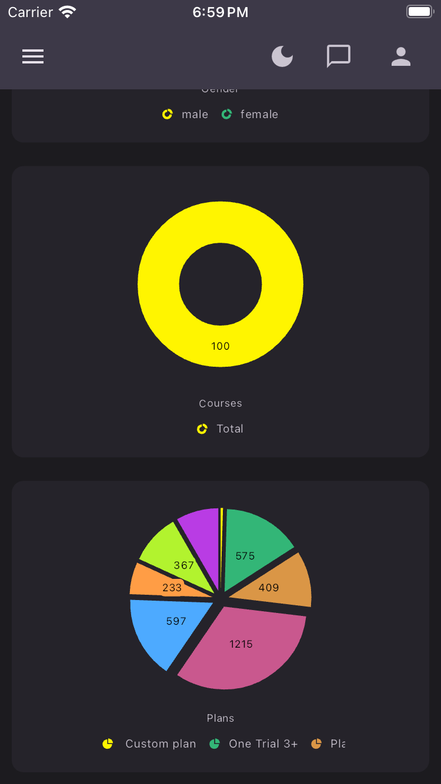

<p align="center">
  
</p>

<p align="center">
  
  
  
</p>


## 🎥 App Preview
<!-- Replace with your GIFs later -->
<p align="center">
  
  
  
  
</p>

---

<!-- video of the whole system -->

<video src="Readme/record_the_system.mp4" width="200" alt="The System"></video>

## 📸 Screenshots Gallery
### 🏠 Home Page


<br clear="left">

---

## 🛠️ Tech Stack
```dart
- Flutter & Dart
- State Management: Bloc Pattern
- Theme: Flexible Dark/Light Mode