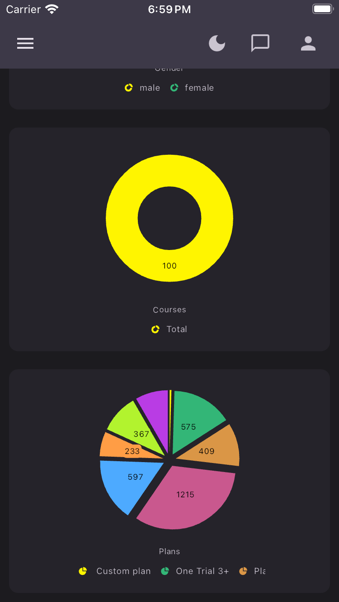
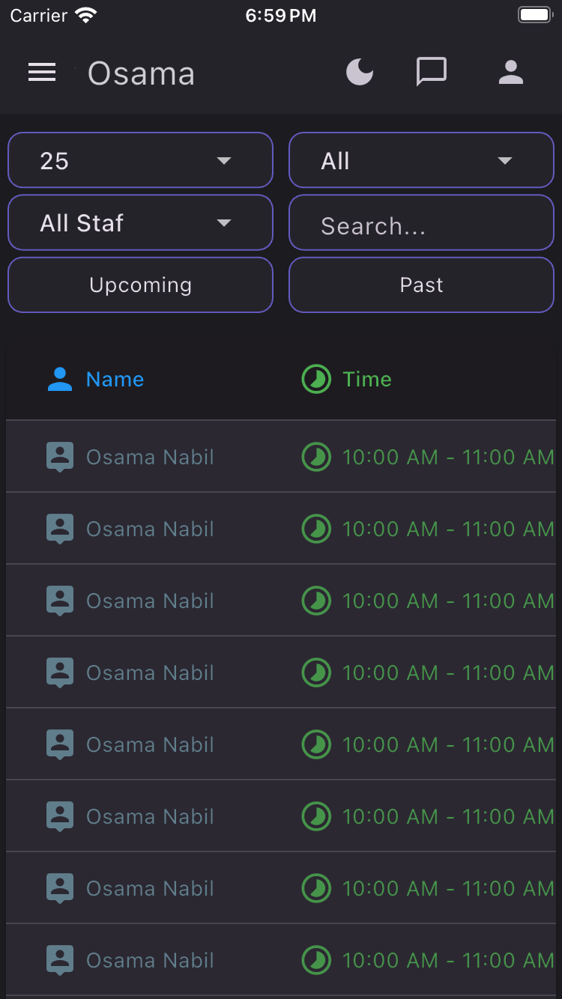
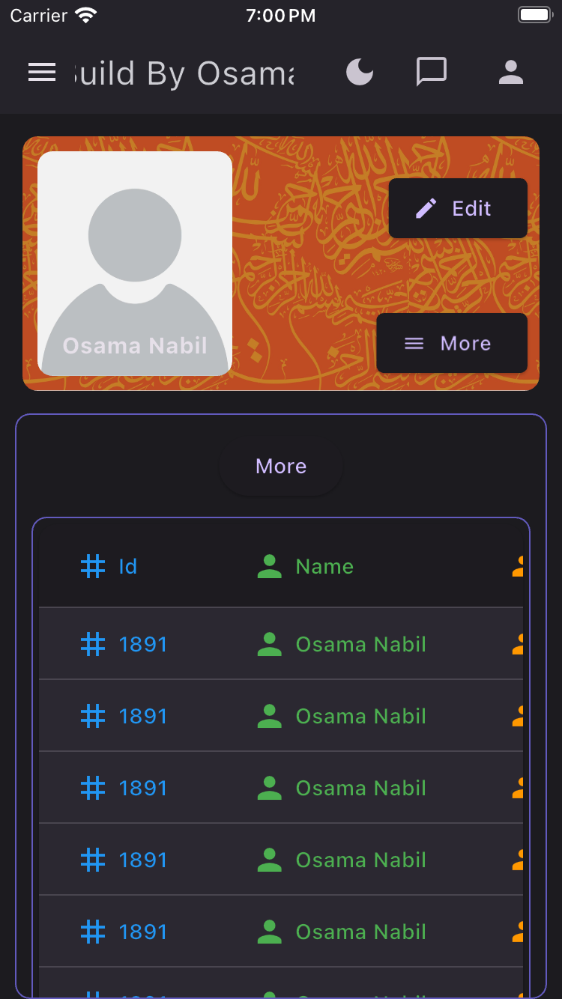
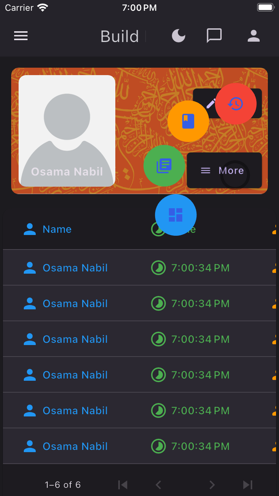
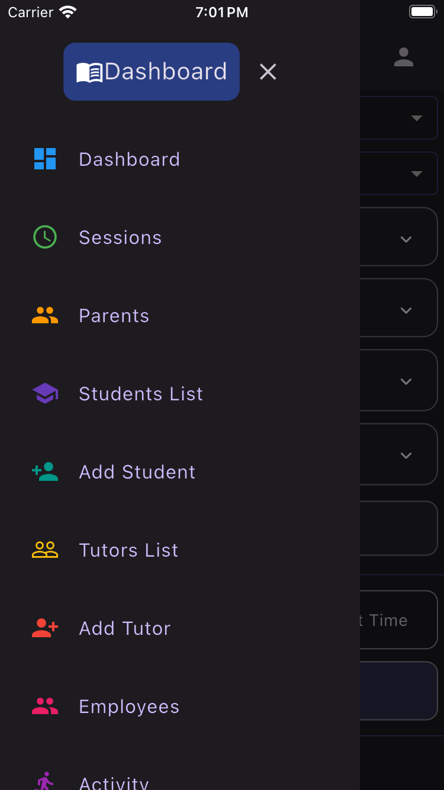
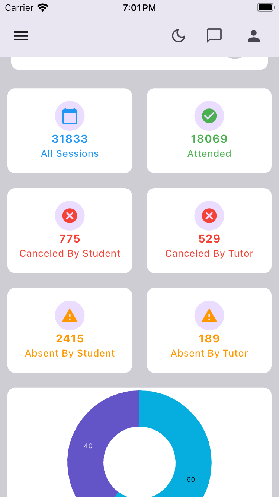
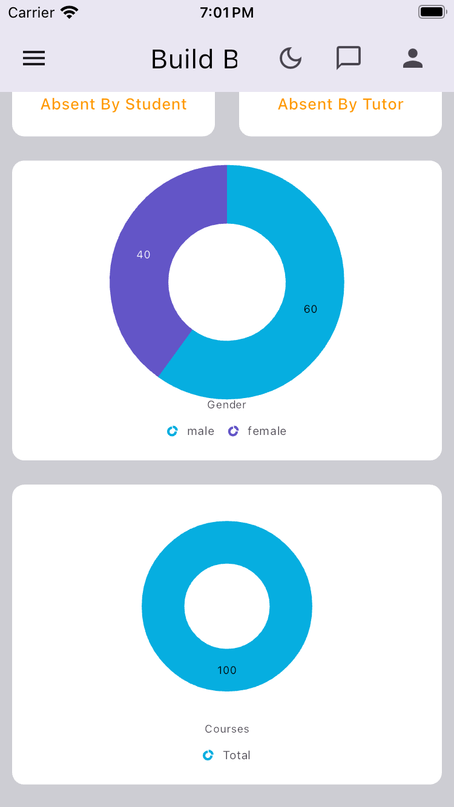
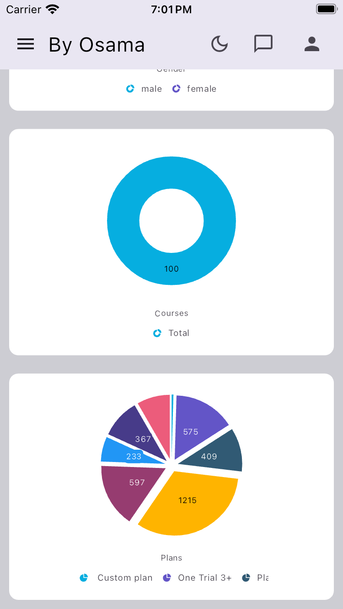
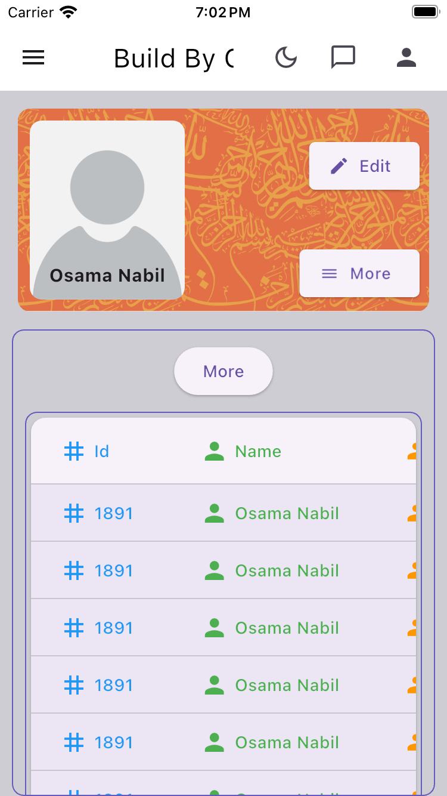
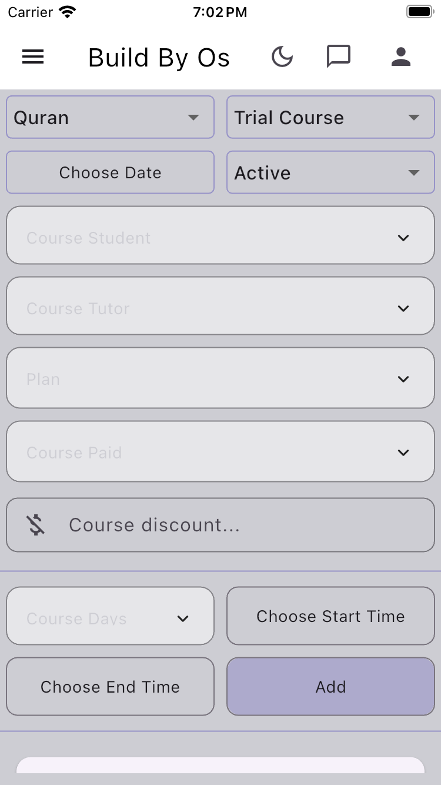

<p align="center">
  
</p>

<p align="center">
  
  
  
</p>

---

## ✨ Key Features
<p align="center">
  

- 🌗 **Smart Theme System**
- ğŸšï¸ **Interactive Dashboard**
- 📊 **Data Visualization**
- 🌠**Multi-language Support**
- 🔄 **Smooth Animations**
- 📱 **Responsive Design**
</p>

---


## 🥠App Preview
<!-- Replace with your GIFs later -->
<p align="center">
  
  
  
  
</p>

---

<!-- video of the whole system -->

## 📹 Video Preview
<video src="Readme/record_the_system.mp4" width="600" height="400" controls></video>


## 📸 Screenshots Gallery




















<br clear="left">

---

## ğŸ› ï¸ Tech Stack
```dart
- Flutter & Dart
- State Management: Bloc Pattern
- Theme: Flexible Dark/Light Mode